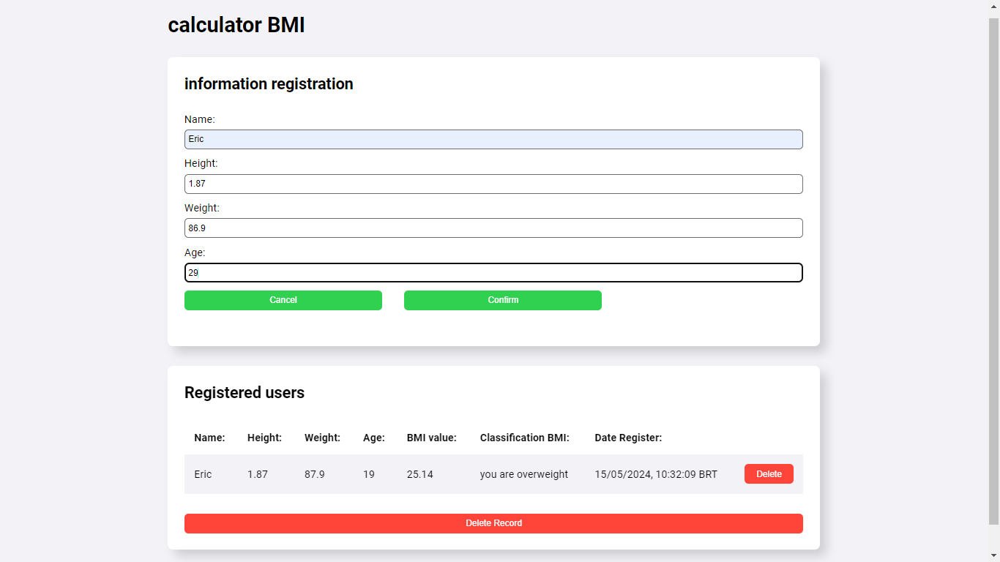
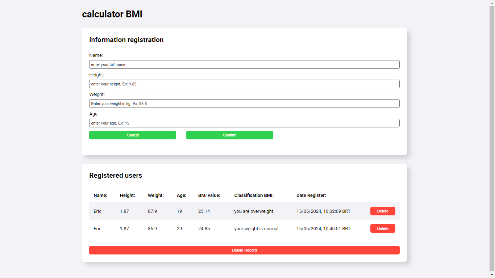
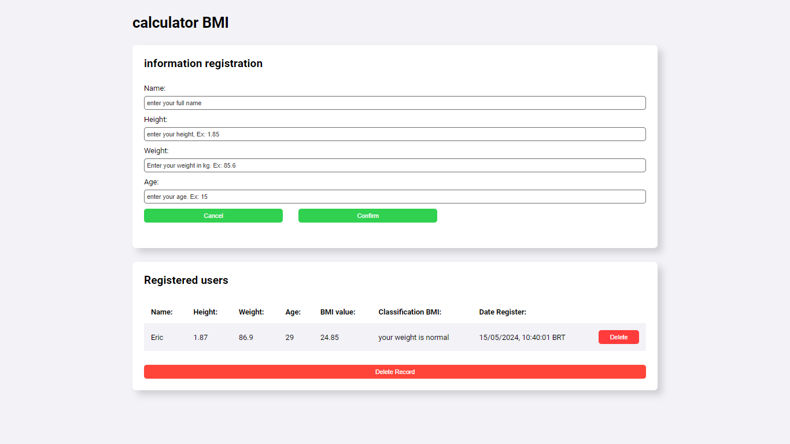

<h1 align="center"> Calculadora de IMC 🧮</h1>

Este é um simples aplicativo web para calcular o Índice de Massa Corporal (IMC) e registrar as informações dos usuários.

## Categorias de Peso 📊
| Categoria          | IMC               |
|--------------------|-------------------|
| Abaixo do Peso     | IMC < 18.5        |
| Peso Normal        | 18.5 ≤ IMC ≤ 24.9 |
| Sobrepeso          | 25.0 ≤ IMC ≤ 29.9 |
| Obesidade Grau 1   | 30.0 ≤ IMC ≤ 34.9 |
| Obesidade Grau 2   | 35.0 ≤ IMC ≤ 39.9 |
| Obesidade Grau 3   | IMC ≥ 40.0        |

<h2 align="center"> Exemplo de Uso 🌟</h2>

Vamos supor que você seja o João:

- Peso: 70 kg
- Altura: 1.75 metros

1. Você inseriria seu nome como `João`.
2. Quando solicitado, insira seu peso como `70`.
3. Em seguida, insira sua altura como `1.75`.
4. E depois a sua idade
5. Seu IMC será calculado automaticamente.
6. Os dados inseridos vão ser mostrados em uma tabela abaixo do formulario indicando sua categoria de peso com base no IMC calculado.

<div align="center">

## Funcionalidades 🛠️

O aplicativo consiste em três seções principais para inserir dados, mostrar dados e deletar dados:

### Inserindo Dados ✏️



Os usuários podem inserir seu nome, altura, peso e idade em um formulário. Com base nessas informações, o IMC é calculado automaticamente.

### Mostrando Dados 📊



As informações dos usuários são registradas em uma tabela, onde é possível visualizar o nome, altura, peso, idade, valor do IMC, classificação do IMC e data de registro.

### Deletando Dados 🗑️




Os usuários podem excluir registros individualmente clicando no botão "Delete" na tabela.

Outra funcionalidade que tem é o "Delete Record", porem ele deleta todos usuários da tabela

</div>

<h2 align="center"> Funcionamento ⚙️</h2>

O aplicativo é desenvolvido em HTML, CSS e JavaScript, e consiste em duas páginas principais:

- **HTML:** A página HTML (index.html) contém os elementos de interface do usuário, incluindo formulários para entrada de dados e uma tabela para exibir os usuários registrados.

- **JavaScript:** O arquivo JavaScript (script.js) contém as funções responsáveis por calcular o IMC, classificar o IMC, organizar os dados dos usuários, registrar os usuários e carregar os usuários registrados na tabela.

<h2 align="center">Uso 🚀</h2>

Para utilizar o aplicativo, basta abrir o arquivo index.html em um navegador da web compatível. Os usuários podem inserir suas informações no formulário e clicar no botão "Confirmar" para calcular o IMC e registrar as informações. Os registros dos usuários são armazenados localmente no navegador.


<h1 align="center"> 📂 Clonando o Repositório 🖥️ </h1>

Se você deseja contribuir ou apenas visualizar o código-fonte, siga estas etapas para clonar o repositório para o seu computador local:

1. Abra o terminal.
2. Navegue até o diretório onde deseja clonar o repositório.
3. Execute o seguinte comando no terminal:

```bash
git clone https://github.com/EricSouzaDosSantos/IMC-HTML.git
```
Além disso, se preferir, você pode dar um fork do projeto para trabalhar em seu próprio repositório do GitHub.


<h2 align="center"> Autor </h2>

Este aplicativo foi desenvolvido por [Eric Souza](https://github.com/EricSouzaDosSantos).
